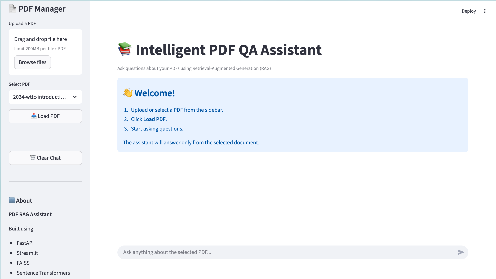
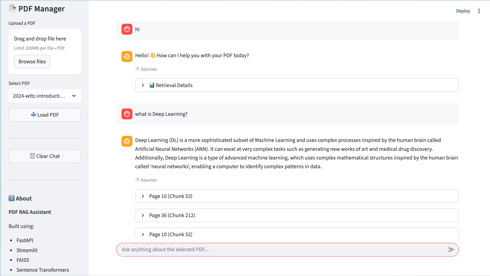
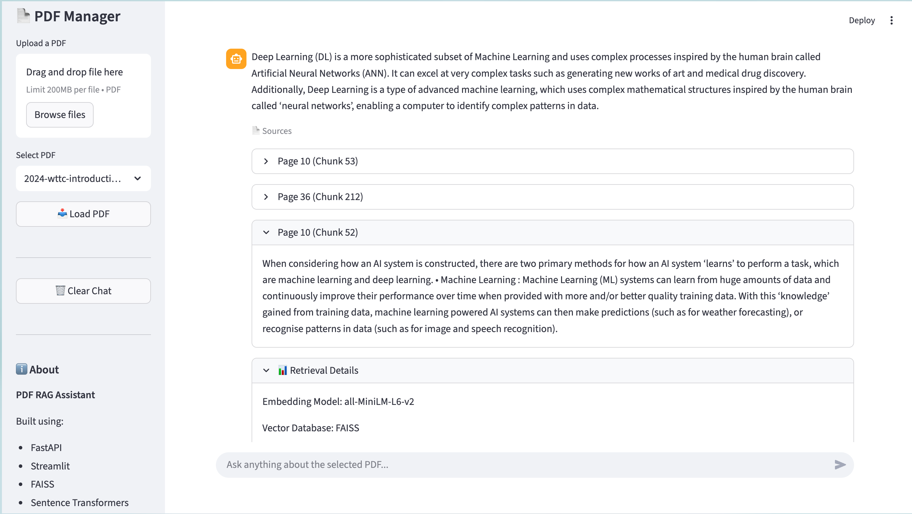

# 📚 PDFRAG

> AI-powered PDF Question Answering System built using Retrieval-Augmented Generation (RAG), FastAPI, Streamlit, FAISS, Sentence Transformers, and Groq LLM.


---

# 📖 Overview

PDFRAG is an AI-powered document question answering system based on the Retrieval-Augmented Generation (RAG) architecture.

Instead of answering from general knowledge, PDFRAG retrieves the most relevant information from uploaded PDF documents using semantic search and generates accurate, context-aware responses using Groq's Llama model.

The application consists of a FastAPI backend responsible for document processing, vector search, and AI response generation, along with a Streamlit frontend that provides a clean and interactive chat interface.

---

# ✨ Features

- 📄 Upload PDF documents
- 📚 Automatic text extraction
- 🧹 Text cleaning
- ✂️ Sentence-based chunking with overlap
- 🧠 Semantic embeddings using Sentence Transformers
- 🔍 Fast similarity search using FAISS
- 🤖 AI-powered answers using Groq Llama
- 💬 Conversation memory
- 😊 Intent classification (Greeting, Help, Thanks, Farewell)
- 📖 Source chunk visualization
- 💾 Cached embeddings
- ⚡ FastAPI backend
- 🎨 Streamlit frontend

---

# 🛠️ Tech Stack

| Category | Technologies |
|----------|--------------|
| Language | Python |
| Backend | FastAPI |
| Frontend | Streamlit |
| LLM | Groq Llama 3.3 70B Versatile |
| Embeddings | Sentence Transformers (all-MiniLM-L6-v2) |
| Vector Database | FAISS |
| PDF Processing | PyMuPDF (fitz) |
| NLP | NLTK |
| Environment | python-dotenv |

---

# 🌟 Key Highlights

- End-to-End Retrieval-Augmented Generation (RAG)
- Semantic Search using FAISS
- Context-aware Question Answering
- Conversation Memory
- Intent Classification
- Source Chunk Display
- Modular Object-Oriented Design
- REST API with FastAPI
- Interactive Streamlit Interface

---

## 🏗️ System Architecture

```text
                                   👤 User
                                      │
                                      ▼
                      🎨 Streamlit Frontend (UI)
                  Upload PDF / Ask Questions / View Sources
                                      │
                             HTTP REST API Request
                                      │
                                      ▼
                           ⚡ FastAPI Backend
                                      │
                                      ▼
                              🧠 RAG Service
                                      │
         ┌────────────────────────────┼────────────────────────────┐
         │                            │                            │
         ▼                            ▼                            ▼
 😊 Intent Classifier          📄 PDF Parser              💬 Chat History
         │                            │
         │                            ▼
         │                     🧹 Text Cleaner
         │                            │
         │                            ▼
         │                     ✂️ Text Chunker
         │                            │
         │                            ▼
         │                🧠 Embedding Generator
         │                            │
         │                            ▼
         │                  🔍 FAISS Vector Index
         │                            ▲
         │                            │
         └──────────────► Query Embedding ◄───────────────┐
                                                          │
                                                          ▼
                                              📚 Top-3 Retrieved Chunks
                                                          │
                                                          ▼
                                               🤖 Groq Llama 3.3 LLM
                                                          │
                                                          ▼
                                         💬 Final Answer + Source Chunks
```

The application follows a Retrieval-Augmented Generation (RAG) pipeline.

1. PDF Upload
2. Text Extraction
3. Text Cleaning
4. Chunking
5. Embedding Generation
6. FAISS Indexing
7. User Query Embedding
8. Semantic Search
9. Groq LLM Response Generation
10. Answer + Source Display

---

# 📂 Project Structure

```text
PDFRAG/
│
├── app/
│   ├── api.py
│   ├── services/
│   │   ├── embedding_generator.py
│   │   ├── faiss_manager.py
│   │   ├── intent_classifier.py
│   │   ├── json_handler.py
│   │   ├── llm_service.py
│   │   ├── pdf_parser.py
│   │   ├── rag_service.py
│   │   ├── text_chunker.py
│   │   └── text_cleaner.py
│   │
│   └── models/
│
├── assets/
│
├── uploaded_pdfs/
├── extracted_text/
├── chunked_text/
├── embedded_chunks/
│
├── streamlit_app.py
├── requirements.txt
├── README.md
├── .env.example
└── .gitignore
```

---

# 🔄 System Workflow

1. User uploads a PDF.
2. PDF text is extracted using PyMuPDF.
3. Text is cleaned.
4. Text is split into overlapping chunks.
5. Sentence Transformer generates embeddings.
6. Embeddings are indexed using FAISS.
7. User asks a question.
8. Question embedding is generated.
9. FAISS retrieves relevant chunks.
10. Retrieved context is sent to Groq LLM.
11. AI generates the final response.
12. Answer and supporting source chunks are displayed.

---

# ⚙️ Installation

### Clone the Repository

```bash
git clone https://github.com/BrihaspatiG/PdfRag.git
cd PdfRag
```

### Create Virtual Environment

```bash
python -m venv .venv
```

### Activate Environment

#### Windows

```bash
.venv\Scripts\activate
```

#### macOS / Linux

```bash
source .venv/bin/activate
```

### Install Dependencies

```bash
pip install -r requirements.txt
```

### Configure Environment Variables

Create a `.env` file.

```env
GROQ_API_KEY=your_api_key_here
```

---

# 🚀 Running the Project

### Start Backend

```bash
uvicorn app.api:app --reload
```

Backend:

```
http://127.0.0.1:8000
```

---

### Start Frontend

```bash
streamlit run streamlit_app.py
```

Frontend:

```
http://localhost:8501
```

---

# 📡 API Endpoints

| Method | Endpoint | Description |
|---------|----------|-------------|
| POST | `/load_pdf` | Load a PDF |
| POST | `/ask` | Ask a question |

---

# 📸 Screenshots

### Home Page



---

### Chat Interface



---

### Source Chunks



---

# 🎯 Skills Demonstrated

- Retrieval-Augmented Generation (RAG)
- Large Language Models
- Semantic Search
- Vector Databases (FAISS)
- Sentence Embeddings
- REST API Development
- FastAPI
- Streamlit
- Natural Language Processing
- Object-Oriented Programming
- Git & GitHub

---

# 🔮 Future Improvements

- OCR support for scanned PDFs
- Multiple PDF support
- Hybrid Search
- User Authentication
- Docker Deployment
- React Frontend
- Cloud Deployment
- PDF Highlighting

---

# 👨‍💻 Author

**Mrityunjay Agarwal**

GitHub: https://github.com/BrihaspatiG

If you found this project useful, consider giving it a ⭐.

---

# 📄 License

This project is licensed under the MIT License.